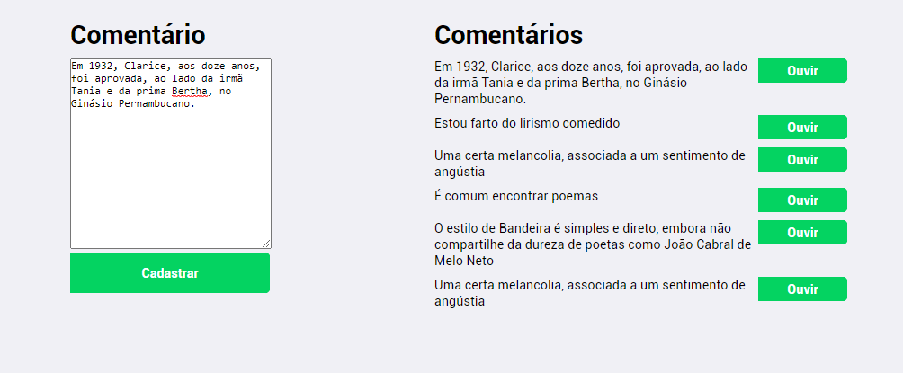

# :star: SMARKIO TESTE FRONTEND
#### Front-end desenvolvido em REACT da aplicação web desenvolvida para o teste prático de programação da SMARKIO.

## Screen Shot

## Instalação em ambiente local:

Você precisa do Node.js, o node global package yarn:

Instalação:

`yarn install` 

Para iniciar a aplicação:

`yarn start`

Para acessar a aplicação no browser:

`localhost:3000`  

## Descrição

Projeto desenvolvido no contexto do teste prático de programação da SMARKIO. O objetivo foi desenvolver o front-end com dois paineis que permitissem cadastro, visualização e execução em aúdio dos comentários listados (voz em português). Para a leitura em aúdio dos comentários foi usado o serviço "Text to Speech" IBM Watson.

Eu comecei o projeto utilizando `create-react-app` boilerplate com typescript. Foram adicionados ao decorrer do desenvolvimento os pacotes react-router-dom, styled-components e polished. 
